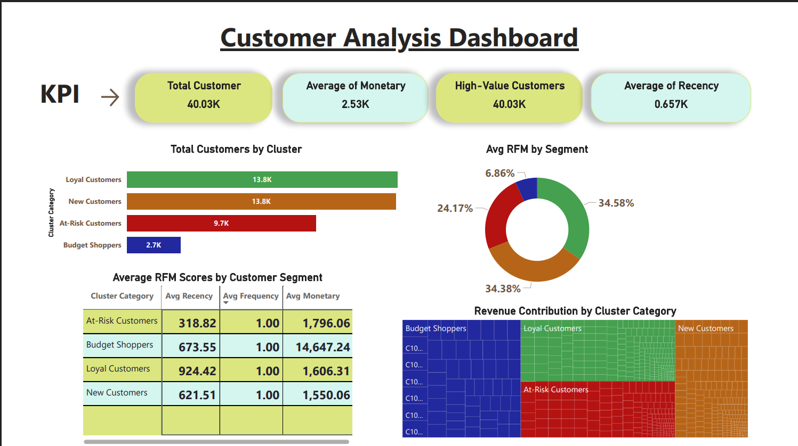

# 🛍️ Customer Segmentation using RFM Analysis & K-Means Clustering

This project performs customer segmentation for an e-commerce platform using **RFM (Recency, Frequency, Monetary)** analysis and **K-Means clustering**. The objective is to group customers based on their shopping behavior so that businesses can personalize their marketing strategies accordingly.

---

## 📊 Project Overview

### ✅ Objective
To identify different customer groups using shopping behavior metrics (Recency, Frequency, and Monetary value).

### 🧠 Techniques Used
- Data Cleaning & Preprocessing
- Feature Engineering (RFM)
- Data Normalization using StandardScaler
- Elbow Method to choose optimal K
- K-Means Clustering for segmentation
- Visualizations using Matplotlib & Seaborn

---

## 🗂️ Folder Structure

```
rfm-kmeans-customer-segmentation/
│
├── data/
│   └── customer_shopping_data.csv
│
├── images/
│   └── dashboard.png
│
├── rfm_clustering.ipynb         # Main analysis notebook
├── rfm_clustering.py            # Python script version
├── requirements.txt             # Python dependencies
├── .gitignore                   # Ignore system/IDE/venv files
└── README.md                    # Project overview (this file)
```

---

## 📸 Dashboard Snapshot

> Example of RFM-based Clustering Output:



---

## ⚙️ How to Run This Project

1. **Clone the repository:**

```bash
git clone https://github.com/Tauheedjahan/rfm-kmeans-customer-segmentation.git
cd rfm-kmeans-customer-segmentation
```

2. **(Optional) Create a virtual environment:**

```bash
python -m venv venv
venv\Scripts\activate  # Windows
```

3. **Install the required libraries:**

```bash
pip install -r requirements.txt
```

4. **Run the Jupyter notebook:**

```bash
jupyter notebook
```

---

## 📝 Requirements

See `requirements.txt` for all required Python libraries:

```
pandas==2.3.0
numpy==2.3.0
matplotlib==3.10.3
seaborn==0.13.2
scikit-learn==1.7.0
notebook==7.4.3
```

---

## 📈 Project Outputs

- RFM Table with Recency, Frequency, and Monetary metrics
- Elbow Plot for optimal `k` value
- Clustered RFM Segments using K-Means
- Visual comparison of customer segments

---

## 👩‍💻 Author

**Tauheed Jahan**  
🔗 [GitHub Profile](https://github.com/Tauheedjahan)

---

## 📄 License

This project is licensed under the **MIT License**.  
Feel free to use, modify, and share it for learning or commercial use.
